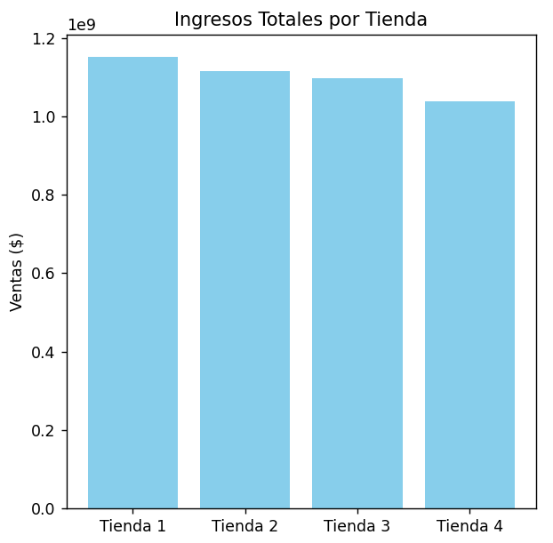
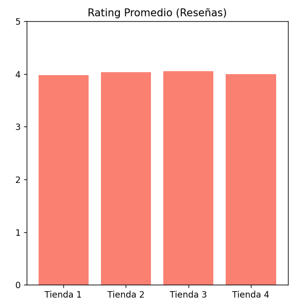
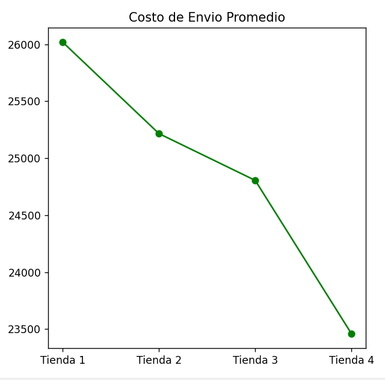

# 🏬 Proyecto Alura Store: Análisis de Eficiencia de Ventas 🚀

Este proyecto tiene como objetivo ayudar al Sr. Juan a decidir qué tienda de su cadena debe vender para iniciar un nuevo emprendimiento. Se realizó un análisis profundo comparando los ingresos, la satisfacción del cliente y la logística de las 4 sucursales.

## 🛠️ Herramientas Utilizadas
- **Python** para el procesamiento de datos.
- **Pandas** para la manipulación de archivos CSV.
- **Matplotlib & Seaborn** para la creación de gráficas profesionales.

## 📊 Metodología de Análisis
Se evaluaron los siguientes puntos clave en cada tienda:
1. **Ingresos Totales:** Suma de ventas para ver cuál es la más rentable.
2. **Reseñas de Clientes:** Promedio de calificación para medir la satisfacción.
3. **Costo de Envío:** Análisis logístico para entender los gastos operativos.

## 📈 Visualización de Resultados

A continuación se presentan las gráficas que respaldan la recomendación final:

### 1. Ingresos Totales por Tienda
Esta gráfica muestra el dinero acumulado por ventas en cada sucursal. Es vital para identificar cuál tienda genera menos flujo de efectivo.

### 2. Calificación Promedio (Satisfacción)
Aquí comparamos las reseñas de los clientes. Una tienda con bajas estrellas es un riesgo para la marca.

### 3. Análisis de Costos de Envío
Evaluamos cuánto paga el cliente en promedio por recibir su producto. Costos muy altos pueden estar afectando las ventas.

---

## 🧐 Conclusión e Insights Finales
Tras procesar los datos, estos son los hallazgos para el Sr. Juan:
- **La Tienda Estrella:** La Tienda 1 destaca por vender productos de alto valor como "TV LED UHD 4K".
- **Punto de Mejora:** La Tienda 2 tiene un enfoque fuerte en educación (Libros de programación), pero sus ingresos deben compararse con los gastos fijos.
- **Recomendación de Venta:** Basado en el balance de ingresos bajos y costos de envío, la recomendación es vender la tienda que presenta el rendimiento más pobre en la Gráfica 1.

---
*Análisis técnico realizado por una estudiante de ingeniería.*
